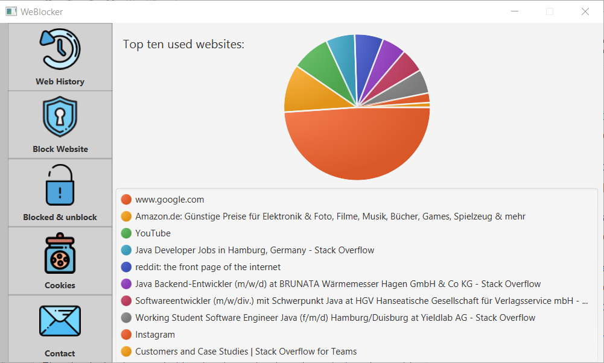

## Summer project 2019 - WeBlocker

**`Author: Ante Skoric`**

WeBlocker is open source tool that allows the user to block and unblock blocked websites,
track and delete cookies, web and terms history.

On the main menu of the app, top ten used websites are displayed in a pie diagram.
This feature is only implemented for Google Chrome.

The user can check the web history and the searched terms history, 
the terms and web history can be deleted.

There is a option for blocking websites, this is implemented for all browsers, 
the domain of the website will be written in the hosts file, this blocks the website.
The user may block a certain websites in two ways:

The first option is to block the website immediately.

The second one is to input **allowed** daily usage of the website,
after seven days (one week) it will be checked if the average daily website usage
of the last seven days is greater then the allowed usage of the website.
If this is the case the website will be blocked.
  
After blocking the website the website will be displayed in the Blocked Websites menu.
The user may unblock websites after they are blocked.

The last feature of the tool is to track and display all cookies.
Creation date, expires date and last access date of the cookie will also be displayed.

